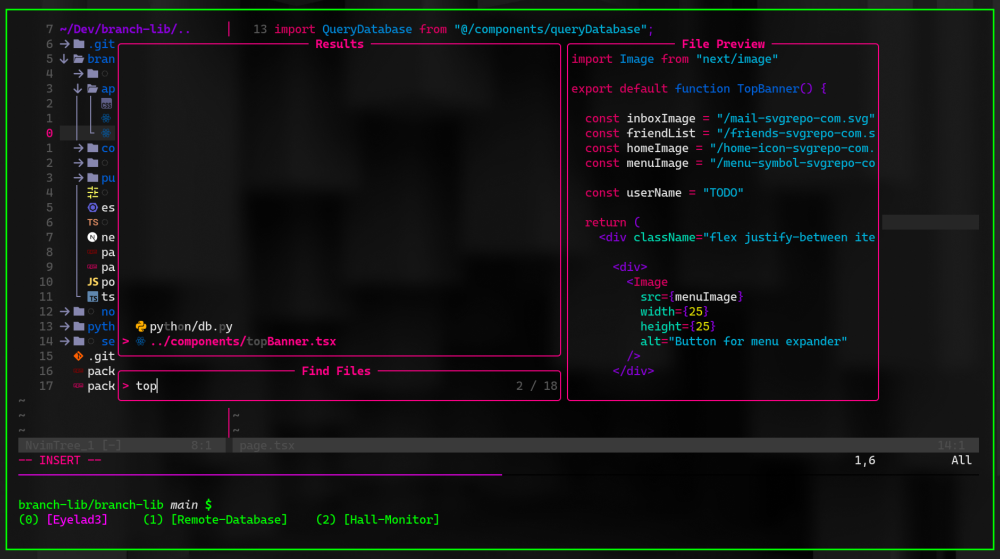

# Cozy Neovim 

### Current Neovim build using [Neovim-Nightly-Overlay](https://github.com/nix-community/neovim-nightly-overlay) to enable Nightly build version 0.12 for Nix builds.

## Feature Todo
- [Flash.nvim](https://github.com/folke/flash.nvim)
- [Alpha-nvim](https://github.com/goolord/alpha-nvim)
- [x] Nvim-ts-autotag
- [x] Gitsigns
- [x] TODO-Nvim
- [x] Treesitter
- [x] Mason
- [x] Neoscroll
- [x] Nvim-tree
- [x] LSP
- [x] Trouble.nvim
- [x] AutoPair
- [x] Nvim-Cmp
- [x] MultiCursor
- [x] Markdown Renderer
- [x] Lualine
